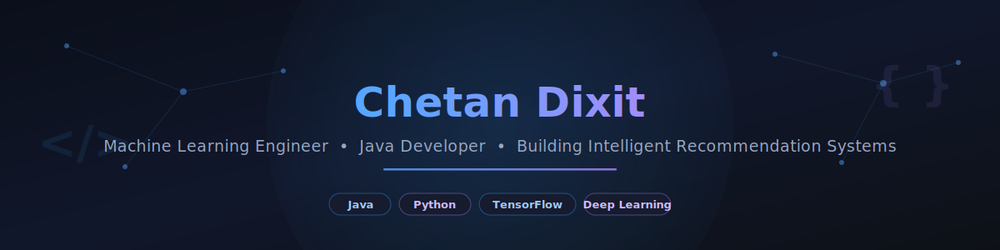

 

 

<a href="#about-me">About</a> •
<a href="#tech-stack">Tech Stack</a> •
<a href="#featured-projects">Projects</a> •
<a href="#dsa--leetcode">DSA</a> •
<a href="#certifications">Certifications</a> •
<a href="#connect-with-me">Connect</a>

---

## About Me

- 🎓 B.Tech Computer Science Engineering student
- 🤖 Interested in **Machine Learning** and **Deep Learning**
- 💻 Core stack: **Java, Python, TensorFlow**
- 🧩 Solving Data Structures & Algorithms in **Java**
- 🛠️ Building **end-to-end ML projects** — from model training to deployment
- 🎯 Seeking **Machine Learning / Software Engineering internships**

---

## Tech Stack

**Languages**

**Machine Learning & Data Science**

**Web Development**

**Tools & Platforms**

**Currently Exploring**

---

## Current Focus

- 🏗️ Building End-to-End ML Systems
- 🧠 Deep Learning
- 🔮 Large Language Models (LLMs)
- 🧩 Data Structures & Algorithms (Java)
- ⚡ FastAPI

---

## Featured Projects

<!-- 📸 Recommendation: place a short architecture GIF/diagram directly under each project title where available. See note at the end of this README for image-placement guidance. -->

### 1. 🎬 Movie Recommender System — Two-Tower Neural Network

A deep learning-based movie recommendation engine built with TensorFlow/Keras using a **Two-Tower architecture** to learn separate user and movie embeddings for personalized recommendations.

<!-- 📸 Add architecture diagram here: user-tower / movie-tower / dot-product similarity flow -->

| | |
|---|---|
| **Dataset** | MovieLens 1M |
| **Performance** | Test MAE: `0.1378` · Test RMSE: `0.1743` |
| **Tech Stack** |    |
| **Key Features** | Embedding-based user/item representations · Two-tower retrieval architecture · Cosine/dot-product similarity ranking |

🔗 **Repository:** [github.com/ChetanDixit-0717/two-tower-movie-recommender](https://github.com/ChetanDixit-0717/two-tower-movie-recommender)

---

### 2. 🔢 Handwritten Digit Recognizer

An Artificial Neural Network (ANN) built with TensorFlow and Keras to classify handwritten digits using the MNIST dataset.

| | |
|---|---|
| **Tech Stack** |   |
| **Key Features** | MNIST dataset · Fully connected ANN classifier · Accuracy/loss visualization |

🔗 **Repository:** [github.com/ChetanDixit-0717/digit-recognizer](https://github.com/ChetanDixit-0717/digit-recognizer)

---

### 3. 📚 Student Management System (CLI)

A command-line based student management system built in Python, supporting full CRUD operations with JSON-based data persistence.

| | |
|---|---|
| **Tech Stack** |  |
| **Key Features** | Full CRUD operations · JSON file-based persistence · Clean OOP structure |

🔗 **Repository:** [github.com/ChetanDixit-0717/student-management-system-cli](https://github.com/ChetanDixit-0717/student-management-system-cli)

---

## DSA & LeetCode

---

## Achievements & Highlights

- 🏆 Solved 100+ DSA problems on LeetCode, earned the *50 Days Badge 2026*
- 🚀 Built and deployed a Two-Tower deep learning recommendation system from scratch
- 📈 Actively building a portfolio of end-to-end ML projects covering the full pipeline — data, modeling, and evaluation
- 🌱 Continuously expanding into backend (FastAPI) and database (SQL/MongoDB) skills to support full ML system deployment

---

## Certifications

| Certification | Issuer | Status |
|---|---|---|
| Machine Learning Specialization | DeepLearning.AI / Coursera |...|
| [Pandas](https://www.kaggle.com/learn/certification/chetan0717/pandas) | Kaggle | ✅ Completed |

---

## Connect With Me

---

